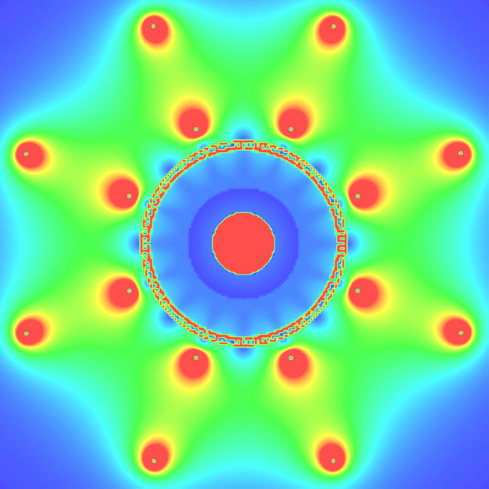

covfie: vector fields made easy
===============================

covfie (pronounced *coffee*) is a **co**-processor **v**\ ector **fie**\ ld
library. This header-only C++ library is designed to make the use of vector
fields as easy as possible, both on traditional CPUs as well as a variety of
co-processors. covfie is provided in the hope that it is useful for scientists
in the domain of high-energy physics, but also other fields where vector fields
are common, such as atmospheric sciences.

   The ATLAS magnetic field, rendered entirely on a GPU with *covfie*.

The covfie documentation consists of three major components. The first is the
user guide, which establishes many of the core ideas behind covfie and details
-- in a global sense -- how it can be used in applications. The second
component details the benchmarking part of covfie, which is a major part of the
software. The third component is the API reference, which describes in depth
the different types and methods that covfie exposes.

User guide
----------

The user guide is a mostly prosaic introduction to the covfie library and its
use. The user guide describes the main design goals of the library, as well as
a step by step introduction to using it.

.. toctree::
   :maxdepth: 2

   user/design
   user/installation
   user/quickstart

Benchmarking
------------

In addition to being a header-only library, covfie is also -- in part -- a
benchmark. The modular design of covfie makes it easy to rapidly and thoroughly
test all kinds of new representations and storage strategies.

API reference
-------------

Coming soon...

Indices and tables
------------------

* :ref:`search`
